# Lukittu 系统设计文档

> 版本：基于源码分析生成 | 日期：2026-06-15

---

## 一、产品定位

### 1.1 是什么

**Lukittu**（芬兰语"锁定"）是一套面向**独立开发者和小型软件团队**的开源软件授权保护服务（License-as-a-Service）。

它的核心价值是：给你开发的应用程序加上一把"锁"，只有持有合法 License Key 的用户才能正常运行程序。

```
你的程序 ──启动时调用──▶ Lukittu API ──返回 valid: true/false──▶ 程序继续/拒绝运行
```

### 1.2 解决什么问题

| 痛点 | Lukittu 的解法 |
|------|----------------|
| 软件被破解/盗版传播 | IP + HWID（硬件ID）双重绑定，防止一授权多用 |
| 无法追踪软件使用情况 | 详细的 RequestLog 记录每次验证请求的 IP、国家、设备 |
| 授权管理繁琐 | 统一仪表盘管理证书、客户、产品版本 |
| 与第三方销售平台割裂 | 原生集成 Stripe / BuiltByBit / Polymart 自动发放证书 |
| 团队协作困难 | 多成员 Team 体系，邀请制管理 |

### 1.3 典型使用场景

- **Minecraft 付费插件**：用户购买后自动获得 License Key，插件启动时验证
- **FiveM / Roblox 脚本**：按服务器 IP 授权，防止二次分发
- **Java 桌面工具**：HWID 绑定防止账号共享
- **SaaS SDK**：为客户发放 API 授权凭据

---

## 二、用户角色体系

Lukittu 有两个维度的角色：**平台角色**（谁在用 Lukittu）和**Team 内角色**（团队协作权限）。

### 2.1 平台角色

```
                    ┌─────────────────────────────────┐
                    │           Lukittu 平台            │
                    └─────────────────────────────────┘
                              │         │
              ┌───────────────┘         └───────────────┐
              ▼                                         ▼
    ┌─────────────────┐                      ┌──────────────────┐
    │  软件开发者       │                      │  终端用户（客户）  │
    │ （Lukittu 用户）  │                      │  （Customer）    │
    └─────────────────┘                      └──────────────────┘
    登录 Dashboard 管理                        不登录 Lukittu
    证书、产品、客户                             只持有 License Key
                                               通过你的软件间接使用
```

| 角色 | 说明 | 如何认证 |
|------|------|---------|
| **开发者（User）** | 注册 Lukittu 账号，管理自己的软件授权 | 邮箱+密码 / Google / GitHub / 双因素认证(TOTP) |
| **客户（Customer）** | 你软件的购买者，持有 License Key | 不登录 Lukittu；可绑定 Discord 账号 |

### 2.2 Team 内角色

Team 是核心隔离单元，一个 User 可以属于多个 Team。

```
Team
 ├── Owner（所有者）
 │    ├── 创建/删除 Team
 │    ├── 转让所有权
 │    ├── 管理集成（Stripe/Discord 等）
 │    └── 所有 Member 权限
 └── Member（成员）
      ├── 管理证书（CRUD）
      ├── 管理产品、客户
      ├── 查看日志、统计
      └── 无法删除 Team / 修改付费订阅
```

> **注意**：Team 角色由 `Team.ownerId === User.id` 判断，没有独立的角色表，是简单的 Owner/Member 二元模型。

### 2.3 API 调用者角色

| 调用者 | 使用哪个 API | 认证方式 |
|--------|-------------|---------|
| **你的软件（客户端）** | `/v1/client/...` | 无需 API Key（公开端点） |
| **你的后端（开发者）** | `/v1/dev/...` | 必须带 API Key |
| **第三方平台** | `/v1/integrations/...` | Webhook Secret 验签 |
| **内部定时任务** | `/v1/internal/...` | INTERNAL_API_KEY |

---

## 三、核心业务流程

### 3.1 证书生命周期

```
创建证书
    │
    ├─ 手动（Dashboard）
    ├─ Dev API（你的后端）
    └─ 第三方集成触发（Stripe 付款 / BuiltByBit 购买）
    │
    ▼
证书状态
    ├─ Active（有效）
    ├─ Suspended（手动暂停）
    └─ Expired（到期）
         ├─ 过期类型：NEVER / DATE / DURATION
         └─ 开始计时：CREATION（创建时）/ ACTIVATION（首次验证时）
    │
    ▼
验证请求  POST /v1/client/teams/{teamId}/verification/verify
    │
    ├─ 检查证书是否存在
    ├─ 检查是否暂停
    ├─ 检查是否过期
    ├─ 检查 IP 绑定限制（ipLimit）
    ├─ 检查 HWID 绑定限制（hwidLimit）
    ├─ 检查黑名单（IP / HWID / 国家）
    ├─ 检查产品/客户/版本绑定
    └─ 返回 { valid: true/false, details: "..." }
```

### 3.2 集成自动发证流程（以 Stripe 为例）

```
用户付款
  └──▶ Stripe 发送 Webhook ──▶ /v1/integrations/stripe?teamId=xxx
           └── 验签 webhook_secret
                └── 触发事件类型
                     ├── checkout.session.completed ──▶ 创建 License + 发邮件
                     ├── invoice.paid ──▶ 更新/续期 License
                     └── customer.subscription.deleted ──▶ 暂停 License
```

---

## 四、数据库设计

### 4.1 ER 图（核心实体）

```mermaid
erDiagram
    User {
        uuid id PK
        string email UK
        string fullName
        string passwordHash
        Provider provider
        bool emailVerified
    }
    UserTOTP {
        uuid id PK
        uuid userId FK
        string secret
    }
    UserDiscordAccount {
        uuid id PK
        uuid userId FK
        string discordId UK
        string username
        uuid selectedTeamId FK
    }
    Session {
        uuid id PK
        string sessionId UK
        uuid userId FK
        string ipAddress
        datetime expiresAt
    }
    Team {
        uuid id PK
        string name
        uuid ownerId FK
        datetime deletedAt
    }
    Subscription {
        uuid id PK
        uuid teamId FK
        string plan
        string stripeSubscriptionId UK
        string status
        datetime billingPeriodEndsAt
    }
    Limits {
        uuid id PK
        uuid teamId FK
        int maxLicenses
        int maxProducts
        int maxCustomers
        int logRetention
        bool allowClassloader
        bool allowWatermarking
    }
    Settings {
        uuid id PK
        uuid teamId FK
        int hwidTimeout
        int ipTimeout
        bool strictCustomers
        bool strictProducts
        bool strictReleases
    }
    ReturnedFields {
        uuid id PK
        uuid settingsId FK
        bool licenseIpLimit
        bool licenseExpirationType
        bool customerEmail
        bool productName
    }
    ApiKey {
        uuid id PK
        string key UK
        uuid teamId FK
        datetime expiresAt
        datetime lastSeenAt
    }
    Product {
        uuid id PK
        string name
        string url
        uuid teamId FK
    }
    ReleaseBranch {
        uuid id PK
        string name
        uuid productId FK
    }
    Release {
        uuid id PK
        string version
        ReleaseStatus status
        bool latest
        uuid branchId FK
        uuid productId FK
        uuid teamId FK
    }
    ReleaseFile {
        uuid id PK
        uuid releaseId FK
        string key
        int size
        string checksum
    }
    Customer {
        uuid id PK
        string email
        string fullName
        string username
        uuid teamId FK
    }
    CustomerDiscordAccount {
        uuid id PK
        uuid customerId FK
        string discordId
        string username
        uuid teamId FK
    }
    License {
        uuid id PK
        string licenseKey
        string licenseKeyLookup
        int ipLimit
        int hwidLimit
        LicenseExpirationType expirationType
        LicenseExpirationStart expirationStart
        datetime expirationDate
        int expirationDays
        bool suspended
        uuid teamId FK
    }
    IpAddress {
        uuid id PK
        string ip
        bool forgotten
        uuid licenseId FK
        uuid teamId FK
        datetime lastSeenAt
    }
    HardwareIdentifier {
        uuid id PK
        string hwid
        bool forgotten
        uuid licenseId FK
        uuid teamId FK
        datetime lastSeenAt
    }
    Metadata {
        uuid id PK
        string key
        string value
        bool locked
        uuid teamId FK
        uuid customerId FK
        uuid licenseId FK
        uuid productId FK
    }
    Blacklist {
        uuid id PK
        BlacklistType type
        string value
        int hits
        uuid teamId FK
    }
    RequestLog {
        uuid id PK
        int responseTime
        string ipAddress
        string country
        RequestStatus status
        RequestType type
        string hardwareIdentifier
        uuid teamId FK
        uuid licenseId FK
        uuid productId FK
        uuid customerId FK
        datetime createdAt
    }
    AuditLog {
        uuid id PK
        string ipAddress
        string country
        uuid userId FK
        string targetId
        AuditLogTargetType targetType
        AuditLogAction action
        AuditLogSource source
        uuid teamId FK
    }
    Webhook {
        uuid id PK
        uuid teamId FK
        string name
        string url
        string secret
        bool active
    }
    WebhookEvent {
        uuid id PK
        uuid webhookId FK
        WebhookEventType eventType
        WebhookEventStatus status
        int attempts
        datetime nextRetryAt
    }
    StripeIntegration {
        uuid id PK
        uuid teamId FK
        string apiKey
        bool active
    }
    DiscordIntegration {
        uuid id PK
        uuid teamId FK
        bool active
    }
    KeyPair {
        uuid id PK
        uuid teamId FK
        string publicKey
        string privateKey
    }
    WatermarkingSettings {
        uuid id PK
        uuid teamId FK
        bool watermarkingEnabled
        int staticConstantPoolDensity
        int dynamicBytecodeDensity
    }

    User ||--o| UserTOTP : "2FA密钥"
    User ||--o| UserDiscordAccount : "Discord绑定"
    User ||--o{ Session : "会话"
    User ||--o{ Team : "拥有(Owner)"
    User }o--o{ Team : "成员"

    Team ||--o| Subscription : "订阅"
    Team ||--o| Limits : "限制配置"
    Team ||--o| Settings : "行为设置"
    Team ||--o| KeyPair : "签名密钥对"
    Team ||--o| WatermarkingSettings : "水印设置"
    Team ||--o| StripeIntegration : "Stripe集成"
    Team ||--o| DiscordIntegration : "Discord集成"
    Team ||--o{ ApiKey : "API密钥"
    Team ||--o{ Product : "产品"
    Team ||--o{ Customer : "客户"
    Team ||--o{ License : "证书"
    Team ||--o{ Blacklist : "黑名单"
    Team ||--o{ Webhook : "Webhook"

    Settings ||--o| ReturnedFields : "返回字段控制"

    Product ||--o{ ReleaseBranch : "分支"
    Product ||--o{ Release : "版本"
    ReleaseBranch ||--o{ Release : "归属分支"
    Release ||--o| ReleaseFile : "文件"

    Customer ||--o| CustomerDiscordAccount : "Discord绑定"
    License }o--o{ Customer : "归属客户(M:N)"
    License }o--o{ Product : "适用产品(M:N)"
    License }o--o{ Release : "允许版本(M:N)"
    License ||--o{ IpAddress : "IP绑定记录"
    License ||--o{ HardwareIdentifier : "HWID绑定记录"

    Metadata }o--o| Customer : "客户扩展字段"
    Metadata }o--o| License : "证书扩展字段"
    Metadata }o--o| Product : "产品扩展字段"
    Metadata }o--o| Release : "版本扩展字段"

    Webhook ||--o{ WebhookEvent : "投递记录"
    RequestLog }o--o| License : "验证日志"
    RequestLog }o--o| Product : "验证日志"
    RequestLog }o--o| Customer : "验证日志"
```



### 4.2 数据库分组说明

#### 👤 用户认证模块
| 表 | 用途 |
|---|---|
| `User` | 平台账号，支持密码/Google/GitHub 登录 |
| `UserTOTP` | TOTP 双因素认证密钥（每用户最多1个） |
| `UserRecoveryCode` | 2FA 恢复码（一次性使用） |
| `UserDiscordAccount` | 用户绑定的 Discord 账号 |
| `Session` | 登录会话（JWT 存 sessionId） |

#### 🏢 团队管理模块
| 表 | 用途 |
|---|---|
| `Team` | 核心隔离单元，软删除（deletedAt） |
| `Invitation` | 邀请成员（邮件邀请，接受后加入） |
| `ApiKey` | 开发者 API Key，支持过期时间 |
| `KeyPair` | RSA 密钥对，用于证书 Challenge 签名验证 |
| `Limits` | 该 Team 的资源上限（许可证数、产品数等） |
| `Settings` | 验证行为配置（HWID 超时、IP 超时、严格模式） |
| `Subscription` | 付费订阅状态（关联 Stripe） |

#### 📦 产品发布模块
| 表 | 用途 |
|---|---|
| `Product` | 你的软件产品 |
| `ReleaseBranch` | 版本分支（如 stable / beta） |
| `Release` | 具体版本（DRAFT→PUBLISHED→ARCHIVED） |
| `ReleaseFile` | 上传的版本文件（R2/S3 存储） |

#### 🔑 核心授权模块
| 表 | 用途 |
|---|---|
| `Customer` | 你的终端用户 |
| `License` | 授权证书（含过期策略、IP/HWID 限制） |
| `IpAddress` | License 绑定的 IP 记录（含遗忘功能） |
| `HardwareIdentifier` | License 绑定的硬件 ID 记录（含遗忘功能） |
| `Blacklist` | 黑名单（HWID / IP / 国家三种类型） |
| `Metadata` | 多态键值扩展（挂在 Customer/License/Product/Release 上） |

#### 📊 日志与监控模块
| 表 | 用途 |
|---|---|
| `RequestLog` | 每次 API 验证请求的完整记录（含响应时间、状态、地理位置） |
| `AuditLog` | 管理员操作记录（谁在何时做了什么） |
| `Webhook` | 你配置的对外 Webhook 端点 |
| `WebhookEvent` | Webhook 投递记录（含重试机制） |

#### 🔌 第三方集成模块
| 表 | 用途 |
|---|---|
| `StripeIntegration` | Stripe 付款 → 自动创建/续期/暂停证书 |
| `DiscordIntegration` | Discord Bot 集成（验证后分配角色） |
| `BuiltByBitIntegration` | BuiltByBit 市场集成 |
| `PolymartIntegration` | Polymart 市场集成 |
| `ProductDiscordRole` | 产品 → Discord 角色 映射 |
| `CustomerDiscordAccount` | 客户绑定的 Discord 账号 |
| `WatermarkingSettings` | Java 字节码水印配置（反追踪泄漏源） |

---

## 五、关键设计决策

### 5.1 licenseKeyLookup（安全哈希查找）

证书实际存储的不是明文 Key，而是 `HMAC(licenseKey + teamId)` 的哈希值作为查找索引。明文 Key 加密存储，防止数据库泄漏后证书 Key 被批量利用。

```
用户提交 licenseKey
    └──▶ generateHMAC(licenseKey + teamId) ──▶ licenseKeyLookup
              └──▶ WHERE licenseKeyLookup = ? （唯一索引查找）
```

### 5.2 Metadata 多态设计

`Metadata` 表通过 5 个可选外键（`customerId` / `licenseId` / `productId` / `releaseId` / `blacklistId`）实现一表挂载多实体。这是一种**多态关联**模式，优点是简单，适合键值对这种通用扩展需求。

### 5.3 IP / HWID 的"遗忘"机制

`IpAddress.forgotten` 和 `HardwareIdentifier.forgotten` 字段实现软删除——管理员可以"遗忘"某个绑定，让该 IP/HWID 可以重新绑定，而不是删除历史记录。`forgottenAt` 记录时间用于审计。

### 5.4 过期策略三模式

```
expirationType = NEVER        永不过期
expirationType = DATE         固定日期过期（expirationDate）
expirationType = DURATION     激活/创建后 N 天过期（expirationDays）
                                └── expirationStart = CREATION   创建时开始计
                                └── expirationStart = ACTIVATION 首次验证时开始计
```

### 5.5 团队软删除

`Team.deletedAt` 实现软删除，配合 `Settings.expiredLicenseCleanupDays` 和 `Settings.danglingCustomerCleanupDays` 的定时清理任务（`/v1/internal/data/cleanup`）自动清理过期数据。

### 5.6 Webhook 重试机制

`WebhookEvent` 有完整的状态机：`PENDING → IN_PROGRESS → DELIVERED / FAILED / RETRY_SCHEDULED`，通过 `nextRetryAt` 字段实现指数退避重试，由内部定时任务 `/v1/internal/webhooks/retry` 驱动。

---

## 六、API 层架构

```
┌─────────────────────────────────────────────────────────────────┐
│                       Next.js App Router                         │
├──────────────┬──────────────┬───────────────┬───────────────────┤
│  Dashboard   │   External   │ Integrations  │    Internal       │
│  /api/(dash) │  /api/(ext)  │  /api/(integ) │   /api/(int)      │
├──────────────┼──────────────┼───────────────┼───────────────────┤
│ 需要登录会话  │ Client: 公开  │ Webhook 验签  │ INTERNAL_API_KEY  │
│ Cookie Auth  │ Dev: API Key  │               │                   │
├──────────────┼──────────────┼───────────────┼───────────────────┤
│ 管理证书/产品 │ 验证证书       │ Stripe 付款   │ 数据清理           │
│ 管理客户/团队 │ 心跳检测       │ Discord 同步  │ Webhook 重试      │
│ 查看日志统计 │ 下载文件       │ BBB/Polymart  │                   │
└──────────────┴──────────────┴───────────────┴───────────────────┘
```

---

## 七、技术栈

| 层级 | 技术选型 |
|------|---------|
| 前端框架 | Next.js 15 (App Router) + React |
| 数据库 | PostgreSQL + Prisma ORM |
| 缓存/限流 | Redis (ioredis) |
| 文件存储 | Cloudflare R2 / S3 兼容 |
| 邮件 | SMTP（支持自定义模板） |
| 付款 | Stripe |
| 错误监控 | Sentry |
| 验证码 | Cloudflare Turnstile |
| Discord Bot | discord.js |
| Monorepo 管理 | pnpm workspace + Turborepo |
| 部署 | Docker Compose |
